# 第一章 图论的基本概念

## 1.1 什么是图

我们首先需要知道什么是图，才能开始讨论图的性质和算法。这里说的图是一幅像梵高画的《星空》那样的图画么？还是百度地图呢？都不是，那它是什么呢？  

图论起源于著名的哥尼斯堡七桥问题。
> 在哥尼斯堡的普莱格尔河上有七座桥将河中的岛及岛与河岸联结起来，问题是要从这四块陆地中任何一块开始，通过每一座桥正好一次，再回到起点。

这个问题你知道如何解决么？欧拉在1736年解决了这个问题，他用抽像分析法将这个问题化为第一个图论问题：即把每一块陆地用一个点来代替，将每一座桥用联接相应的两个点的一条线来代替，从而相当于得到一个“图”（如下图）。

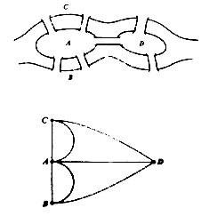  
图1.1 七桥问题

因此我们按如下方式定义一张图：  
**图`G=(V, E)`，其中`V={vi}`表示图上的点集，其元素称之为顶点，`E={<vi-vj>| vi, vj in V}`表示顶点与顶点之间关系的边集，图`G`就是`E`和`V`的二元组。**

对于七桥问题，有点集`V={A, B, C, D}`,边集`E={<A-B>1, <A-B>2, <A-C>1, <A-C>2, <A-D>, <B-D>, <C-D>}`（`<x-y>`表示点`x`和点`y`之间存在一条路）。

## 1.2 无向图和有向图

1. 无向图：在一个图中，如果它的任意一条边是无方向的，即对于边`<x-y>`，`x`和`y`可以通过该边互相到达，那么称这个图为无向图，称无方向的边为无向边。通常来说公交线路及其站点就是一个无向图，可以从站点A到达站点B，也可以通过同样的路从B到达A。
2. 有向图：在一个图中，如果它的任意一条边是有方向的，就像城市中的单行道，那么这个图就是有向图。
3. 混合图：既有有向边也有无向边的图，这是一种特殊的图。

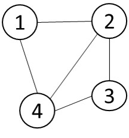
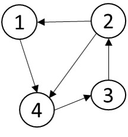
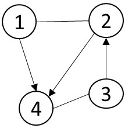  
图1.2 从左至右分别为无向图、有向图及混合图

## 1.3 图的储存结构
一般对于一个图`G=(V,E)`，我们有两种常用方法来储存（表示），即邻接矩阵法和邻接表法。

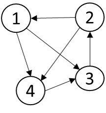  
图1.3 示例图`G1`

#### 邻接矩阵法：
在邻接矩阵表示法中，我们用一个`V*V`的矩阵`A`表示顶点之间的相连关系。通常把`A(i,j)`设为`0`或者无穷大（`inf`）表示不存在边`<i->j>`，否侧，`A(i,j)`即说明存在边`<i->j>`，并且其值就是边`<i->j>`的权值。对于无向图，邻接矩阵`A`是一个对称矩阵。一个图的邻接矩阵表示，需要占用`O(V*V)`的储存空间，与其边数无关。

这种表示方法的不足在于对于一个`|E|<<|V*V|`的稀疏图，它的空间消耗会比邻接表表示大很多，同时它无法保存重边。

下图说明图`G1`如何在邻接矩阵中存放的。  
  
图1.4 图`G1`的邻接矩阵表示法

#### 邻接表法：
我们用`|V|`个链表表示图`G`，对于`V`中的任意一个顶点`v`，都对应一个表头元素为`v`的链表，该链表表头之后紧接着的元素`u`都满足`<v->u> in E`。

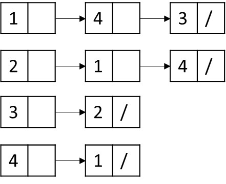  
图1.5 图`G1`的邻接表表示法

习题1.3将要求读者采用链表这一数据结构编程实现图的邻接表示。

以下代码是用数组对邻接表的模拟，以后章节大部分的图都将采用这种方式表示：

	int head[MAXN]; //从i点出发的最后一个子节点的位置
	struct node{
	    int cur,pre,weight;//cur当前节点标号，pre前一个兄弟节点位置，weight表示边<from->cur>的权重
	}edge[MAXN];
	int cnt;//边数
	
	void initEdge(){//初始化边
	    cnt = 0;
	    for(int i = 0;i < MAXN;i ++)head[i] = -1;
	}
	
	void addEdge(int from,int cur){ //加入新的边
	    edge[cnt].cur = cur;
	    edge[cnt].pre = head[from];
	    head[from] = cnt ++;//head值更新为当前顶点位置
	}
	
	void print(int v){
	    for(int i = head[v];i != -1;i = edge[i].pre){//依次访问顶点v的邻接顶点
	        int cur = edge[i].cur;
	        printf("%d ",cur);
	    }
	}

## 1.4 度
对于顶点`i`，我们把顶点`i`所邻接的边数称之为顶点`i`的度，记为`deg(i)`，其中指向顶点`i`的边数称之为入度，记为`id(i)`，类似的，顶点`i`有出度，记为`od(i)`。

对于图`G=(V,E)`，总有`deg(i) = |id(i)| + |od(i)|`。  
对于无向图，总有`|id(i)| = |od(i)|`。
#### 拓扑排序
大学某些课程是有先修关系的，比如学习数据结构之前必须先学C语言，学习数值分析之前要先学高等数学和线性代数等等。那么给定课程之间的先修关系，如何得到一个合法的课程学习顺序，即使得对于任意一门课程y，其先修课程都排在它的前面。

首先我们对这个问题形式化，对有向图`G=(V,E)`进行拓扑排序后，拓扑序列，满足对于所有有向边`<a->b>`，`a`都在`b`的前面。

思考以下两幅图是否存在拓扑序列。

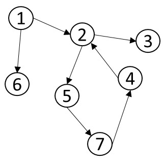  
图1.4

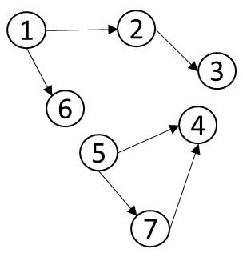  
图1.5

**定理1.1：一个存在拓扑序列的图，必然是一个有向无环图。**  
对于该定理，此处不做证明。

我们将通过以下算法步骤解决该问题：

1. 计算所有顶点的入度；
2. 将入度为0的顶点`u`及其邻接的边从图中删除，并将该顶点`u`加入已排序序列。入度为0的顶点u说明此时图中不存在有向边`<v->u>`使得另一顶点`v`排在`u`前面；
3. 重复步骤1、2，直至不存在入度为0的顶点；
4. 如果此时图中还存在顶点，那么剩下的顶点及边将形成至少一个回路，出现矛盾，所以原图不存在拓扑序列；如果图中无顶点，那么已排序序列即为所求拓扑序列，算法结束。

代码：

	int sortlist[1000];
	int topsort(){
	    queue<int>q;
	    int idx = 0;
	    for(int i = 0;i < n;i ++){//n为要排序的顶点个数
	        if(indgree[i] == 0){
	            q.push(i);
	        }
	    }
	    while(q.empty()==0){
	        int cur = q.front();
	        sortlist[idx++] = cur;
	        q.pop();
	        n--;
	        for(int i = 0;i < l[cur].size();i ++){//l[cur][i]表示以cur为起点i为终点的有向边
	            indgree[l[cur][i]] --;
	            if(indgree[l[cur][i]] == 0){
	                q.push(l[cur][i]);
	            }
	        }
	    }
	    if(n > 0)return 0;   //当n>0时，说明有节点未排序则表示节点关系有冲突
	    return 1;
	}

#### 欧拉图
我们在1.1节提出了七桥问题。七桥问题的一般形式是一笔画问题，对于一个图`G=(V,E)`，我们是否能从某点开始，经过所有边仅一次。如果能，那么我们称该路径为欧拉路径。同时将最后回到起点的欧拉路径称之为欧拉回路，那么称存在欧拉回路的图为欧拉图。  
对上题进行简化可知，就是判断欧拉图并输出欧拉路径。

1. 如何判断一个图是否存在欧拉路径？
2. 如何判断一个图是不是欧拉图呢？

为解决以上两个问题，首先我们必须要将不连通的图排除，因为不连通的图肯定不存在欧拉路径，如图1.6所示.

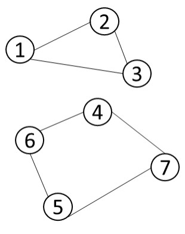  
图1.6 非连通图

思考下面这幅图是否存在欧拉路：

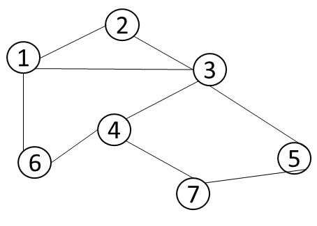  
图1.7 判断是否为欧拉图

我们将连通图简单地分为无向连通图和有向连通图进行分类讨论。

**定理1.2：**  
无向连通图`G`存在欧拉路径的充要条件是：`G`上所有顶点的度数为偶数，或者只有2个顶点度数为奇数。  
无向连通图`G`是欧拉图的充要条件是：`G`中每个顶点的度都是偶数。  
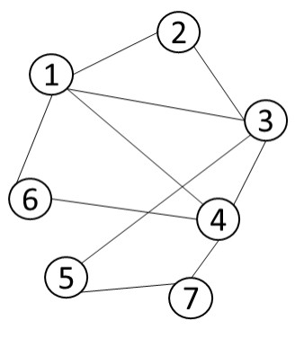  
图1.8 无向欧拉图

**定理1.3：**  
有向连通图`G`存在欧拉路径的充要条件是：每个顶点入度等于出度；或者只有1个点入度比出度小1，只有1个点出度比入度小1，并且其他点入度等于出度。  
有向连通图`G`是欧拉图的充要条件是：每个顶点入度等于出度。

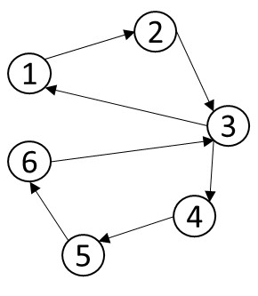  
图1.9 有向欧拉图

## 习题
1. 1.1节我们描述过七桥问题。
	1. 七桥问题是否有解？如果有解，请画出解在图上的路径。
	2. 对于混合图，如何求解其欧拉回路？
2. 对于图的两种储存结构，删除一条边，分别需要多少时间？删除一个顶点，分别需要多少时间？
3. 请采用**链表**这一基础数据结构，编程实现图`G`的邻接表表示。
4. 在1.4节，有同学提出，也可以利用并查集对有向图的回路（环）进行检测，即在加入有向边`<a->b>`之前，`a`，`b`两顶点在同一集合，那么`a`，`b`两点就在一个回路上。请举例证明这种想法是错误的。
5. 请在hdu oj上编程解决以下题目：
	- 1285 确定比赛名次
	- 2094 产生冠军
	- 2647 Reward
	- 3342 Legal or Not
	- 1811 Rank of Tetris
	- 3231 Box Relations
	- 1878 欧拉回路
	- 3018 Ant Trip
	- 1116 Play on Words
	- 2894 DeBruijin
	- 1956 Sightseeing tour
	- 3472 HS BDC
